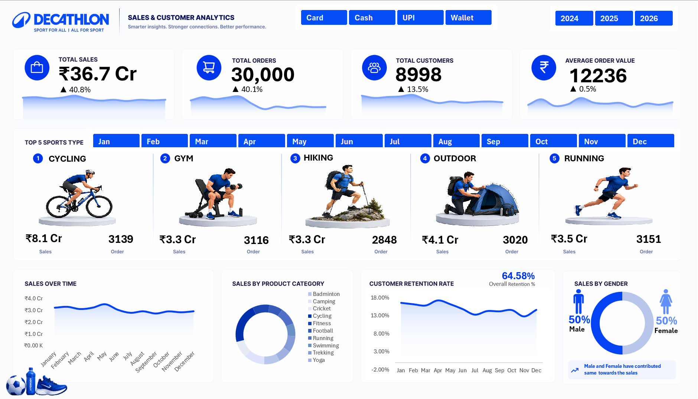

#  Decathlon Sales Dashboard

An interactive **Excel Sales Analytics Dashboard** built using a dataset of **30,000 orders** to analyse sales, customers, products, and business performance.

> **Tools:** Excel • Power Pivot • DAX • PivotTables • PivotCharts • Slicers

---

## 📸 Dashboard Preview

---

## 📊 Project Overview

This project transforms raw retail transaction data into an interactive Excel dashboard designed to answer key business questions around:

- 📈 Sales & YOY Performance
- 🛒 Orders & Average Order Value
- 👥 Customer Performance & Retention
- 🏆 Sport type Performance
- 📅 Monthly Trends

The dashboard uses **Power Pivot, DAX, PivotTables, PivotCharts, and interactive slicers** to make the analysis dynamic.

---

## 🔑 Key KPIs

| KPI | Value |
|---|---:|
| **Total Sales** | ₹36.7 Cr. |
| **Total Orders** | 30,000 |
| **Total Customers** | 8,998 |
| **Average Order Value** | ₹12,236 |
| **Customer Retention** | 64.58% |

---

## 🔍 Key Insights

- 🚴 **Cycling** is the top-performing category with **₹8.1 Cr.** in sales.
- 📈 Sales increased by **1.06% in 2025** compared with 2024.
- ⚠️ Sales declined by **18.88% in 2026** compared with 2025.
- 🥇 **May** recorded the highest monthly sales at **₹3.5 Cr.**.
- 👥 Male and female customers contribute almost equally to total sales.
- 🔄 Customer retention stands at **64.58%**.

---

## 🛠️ Tools & Skills

**Excel**

- PivotTables & PivotCharts
- Slicers
- Custom Formatting
- Dashboard Design

**Power Pivot & DAX**

- Data Modeling
- KPI Measures
- `CALCULATE`
- `DATEADD`
- `DIVIDE`
- YOY Analysis

**Analytics**

- Sales Analysis
- Customer Analysis
- Trend Analysis
- Business Insights

---

## 📁 Files

| File | Description |
|---|---|
| `Decathlon_Synthetic_Data_30000.xlsx` | Excel dataset, analysis & dashboard |
| `dashboard-image.png` | Dashboard preview |
| `README.md` | Project documentation |

---

## 🚀 How to Use

1. Download the Excel workbook.
2. Open it in **Microsoft Excel**.
3. Go to the **Dashboard** sheet.
4. Use the slicers to interact with the analysis.

---

## 👤 Author

### Raghav Bajaj

**MBA — Finance & Business Analytics**

`Excel` • `Power Pivot` • `DAX` • `SQL` • `Power BI` • `Data Analysis`

---

⭐ **If you found this project useful, consider giving the repository a star!**
